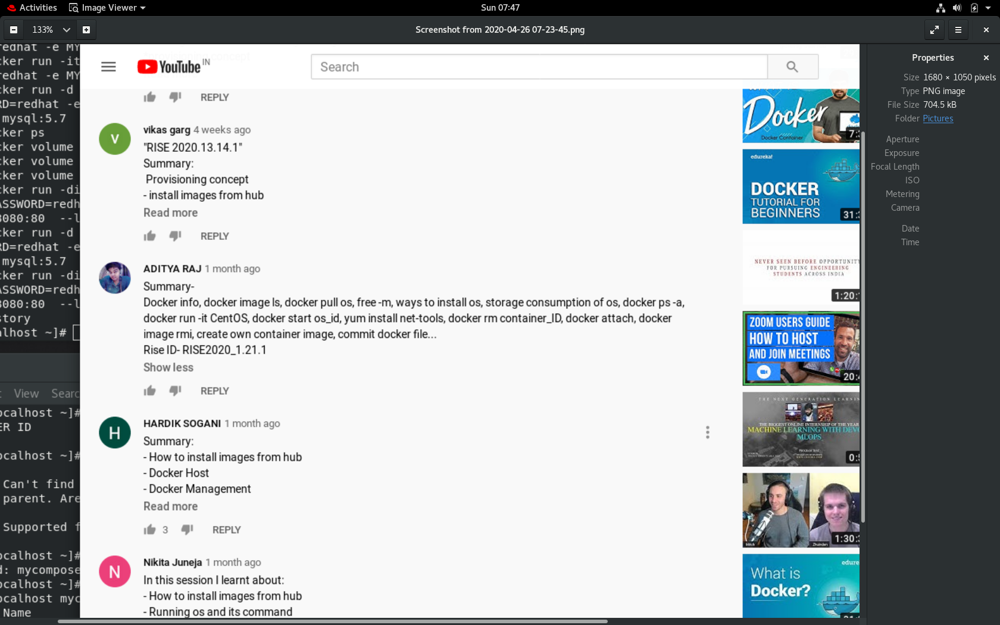
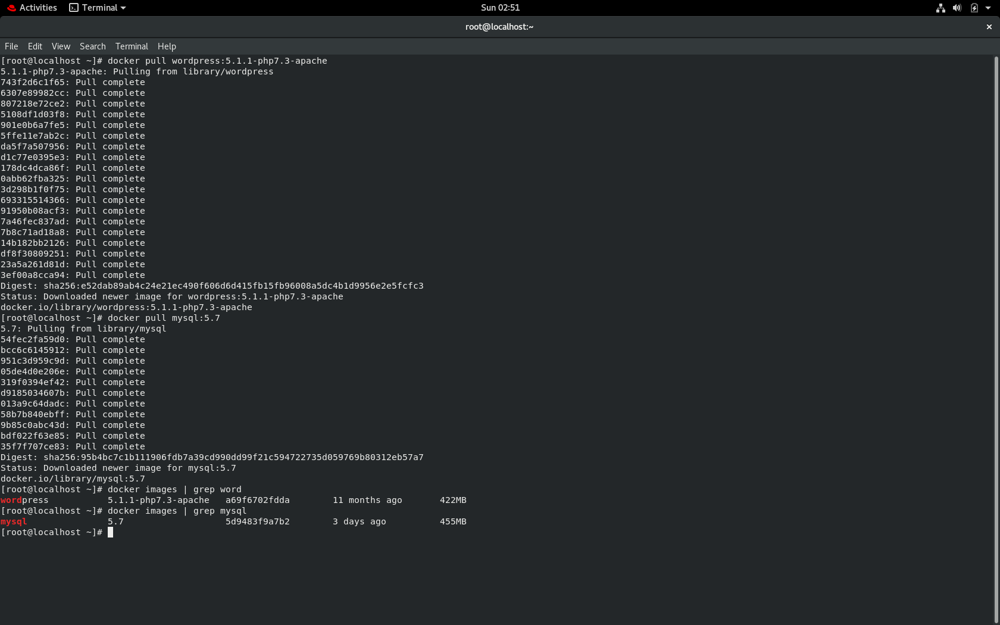
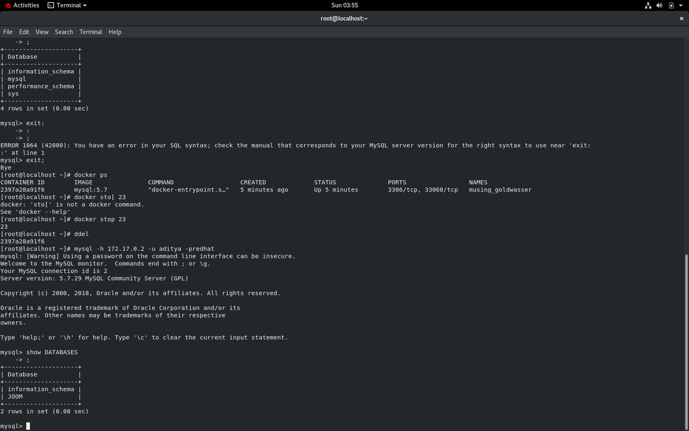
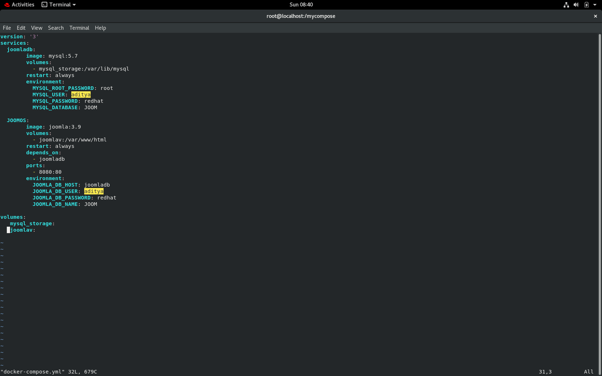
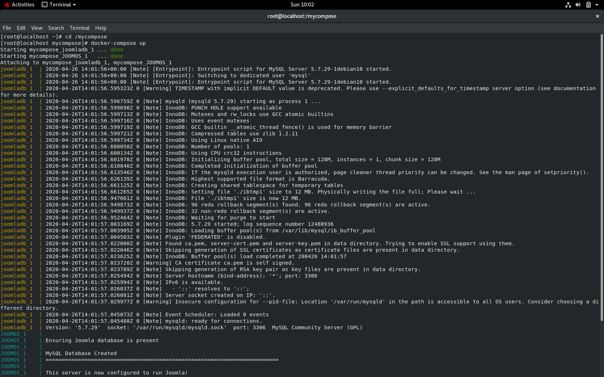
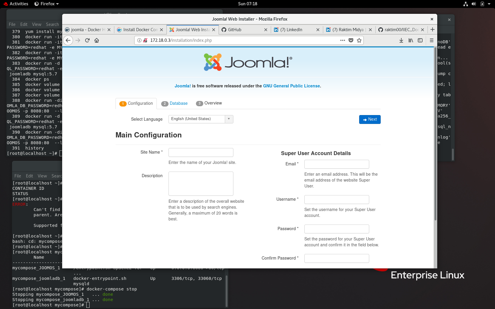
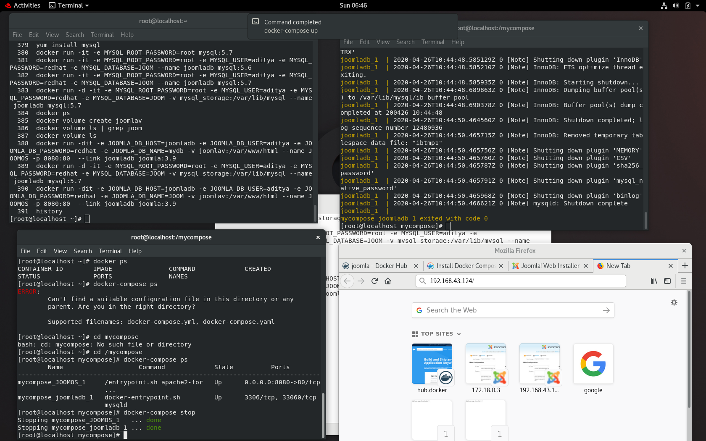
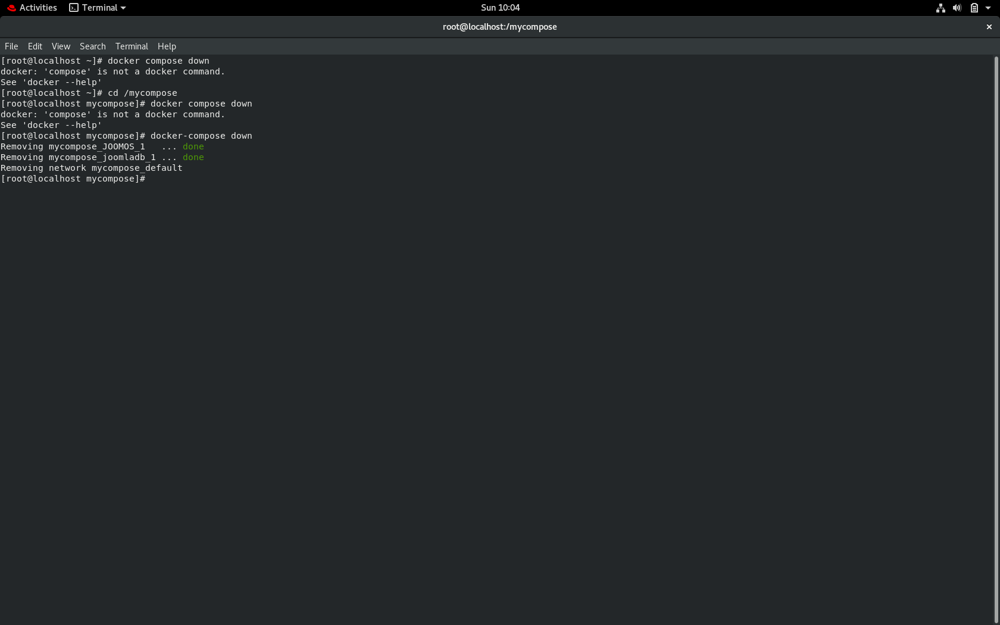
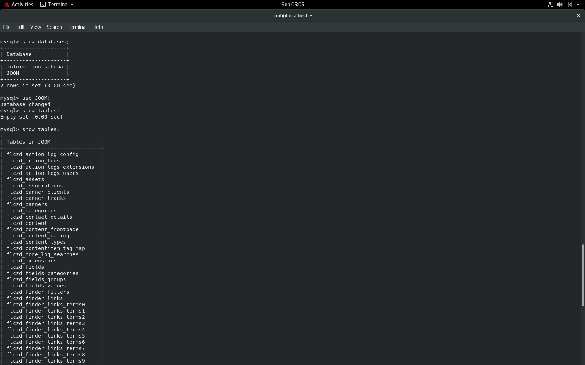

#HEY GUYS!!

**FIRST OF ALL A BIG-BIG THANK YOU FOR ALL THE THINGS YOU TAUGHT WITHOUT YOUR SUPPORT I DON'T KNOW HOW MUCH TIME I WOULD HAVE TAKEN TO LEARN DOCKER**
So, this is a mini-project that I worked on Docker while training under the guidance of Vimal Daga Sir under **IIEC-RISE 1.0** Campaign. The things that I learnt can't be explained just in a single document.
But part of it can be shared:

**Note**-The name ADITYA RAJ in the SS is me. ;)

### Session 1:

### Session 2: 

### Session 3: 

### Session 4: 

### Session 5: 

### Session 6: 

So coming on to my project------
# DOCKER PROJECT ON SETTING UP JOOMLA WITH MYSQL with a single command.
Using Docker to set-up a WebApp called **Joomla** with **MYSQL** as a database.

## About the tools used:
Joomla is a free and open source content management system (CMS), used for creating dynamic websites. It is the second most used CMS in the world (after WordPress), and it uses a model-view-controller (MVC) framework that is independent of the system itself.

Written in PHP, Joomla connects to a variety of database backends, including MySQL and PostgreSQL, and its features include the ability to create and manage blogs, RSS feeds, caching, printable pages, searching, news flashes and support for language localization. Joomla also provides more than 8,000 extensions (both free and commercial), and others are available through third-party sources.
## 1. Pre-configurations needed:
* There is not exactly any technicalities issue with using docker over other compatible OS(prefer documentation to know where it can work on), while I used **RedHat Enterprise Linux Version 8(RHEL 8)**. Although the commands mentioned here may not be supported over other Linux versions, Windows Server, etc. I will try my best to explain the terms and commands used.
## 2. Setting up the required things:
* Starting the docker:
  * Use `systemctl start docker` to start Docker Service.
* Disabling Firewall inside host OS can help in situations where network connectivity between containers are cut off.
  * Use `systemctl stop firewalld`.
## 3. Downloading required images:
* Pulling MySQL Image:
  * Use `docker pull mysql:5.7` to download the **mysql version 5.7** image to use as a database server.
  * To know more about MySQL Image go to this page: https://hub.docker.com/_/mysql
* Pulling Joomla Image:
  * Use `docker pull joomla:3.9-php7.2-apache` to download the Joomla Image in which php and apache server is already preconfigured.
  * To know more about Joomla Image go to this page: https://hub.docker.com/_/joomla

**Note**- I used these specific versions because they are stable and there is no compatibility issue that may arise for the same. While you can try experimenting on your own which commands run or not. ;)
  

## 4. Setting up MySQL:
* Use `docker run -it -e  MYSQL_ROOT_PASSWORD=(any password) -e MYSQL_USER=(any user name) -e MYSQL_PASSWORD=(any password) -e MYSQL_DATABASE=(any database name) --name joomladb mysql:5.6` this code and it will create a user with a database inside Your MySQL Server.

**Note**-Recommended not to give MYSQL root user access and password.

* Now if you want to see if your database is created or not then you have to install **MySQL cilent software** in your base OS. For that use `yum install mysql`. Next thing check your database server ip address(`ifconfig enp0s3`) and use that ip(`mysql -h 172.17.0.2 -u aditya -predhat`)

**Note**-Here instead of my IP, username, password give yours and after -p there is no space when typing password.

## 5. Docker-Compose:
  * Before using Docker-Compose you should install the software. For reference go to this website : https://docs.docker.com/compose/install/
  * It is recommended to create a separate directory when working on docker compose. As Docker Compose only reads file name **docker-compose.yml** so if user wants to launch multiple web servers, one can do so easily.
  * Create and edit this file using vim or vi editor. For that use `vim docker-compose.yml`. Remember again the file name should always be **docker-compose.yml**.
  * In the below picture you can see the composed file. Let me tell you how it's done.

### version:
   * I used version 3 cause it's easy to compose than other versions. In each version the style and syntax are different.
### services:
   * In docker compose we use the term services to specify which containers will run when we start the compose file.
### container name:
   * **joomladb** and **JOOMOS** are the name of the containers which I used here for MYSQL and JOOMLA.
### image and restart:
   * **image** and **restart** these two key is used to specify which image we want to use and due to any reason if any of the container stops docker-compose will again restart it.
### volumes:
   * In docker as soon as we terminate any container our whole data inside that container destroyed. But if we want to make our data permanent then we have to use **docker volume**. We know that MySQL and Joomla stores their data inside which folder. We simply make those folders permanent by binding these volumes which means due to any reason if our container is terminated our data will not be lost.

**Note**- You need to declare the storage to create or use in the services that you wish to bind before using inside the container.

### environment:
   * There are many images in Docker which needs some pre-defined environment variables to run. That's why we need to pass these variables.
### depends_on and ports:
   * As we know Joomla needs MySQL database server to store there files that's why we are using **depends_on**. Also we know that we have to expose our container(where joomla running) to a specific **ports** otherwise from outside world we will not be able to access our WebApp.
   
## 6. Docker-compose up:
  * Now all that is left is to start the webserver with a database`docker-compose up` to complete the setup.

**Note**- If you followed everything whether with indentation in YAML file, with supported compatibility between webserver and mysql there shouldn't be any problems.

## 7. Joomla Started:
  * Got to your browser and type `172.17.0.3:80` or `192.168.43.124:8080` and done you will be able to see your Joomla WebApp. But if you want to use any other port then you have to mention it in your docker-compose file.

## 8. Docker-compose start/stop:
   * After using docker compose up now in one command `docker-compose up` you can stop your whole setup. Just use `docker-compose stop`. Again you want to start the service use `docker compose start`. 

## 9. Docker-compose down:
  * You can easily stop the containers using `docker compose down` command.See below image.

## MYSQL DATABASE AUTO UPDATION:
You can easily know the fields required in the webserver after successfully logging the page. See the below image:

## Troubleshooting and Solves:
   * Next problem might happen after you setup your MySQL you up your docker compose and your joomla might not get the connection with MySQL. It's probably because there are limitations that how much container you can connect with your database server. After setting up the MySQL user and database name run this command `docker rm -f $(docker ps -aq)` . This command will remove all the previous containers. Otherwise you can also use `docker ps -a` to see which container is running on MySQL server and you can remove that particular container using `docker rm (container id)`.
   * Next problem might happen like your joomla is unable to connect to database server. It's probably because your iptables doesn't get updated as soon as you do the previously mentioned action. So final and last solution is that you should at first remove the containers create previously by docker compose and then restart your docker using `systemctl restart docker` and now you just up the docker-compose and it will work fine. 
## Future possibilities:
   ### This whole setup is done in local machine. But exactly same thing we can do in cloud to setup a Joomla WebApp. We can use many cloud services like AWS EC2,Google Cloud, etc. for this. You can also create your own webapp with many different softwares with other supported database servers.

## Manual way:
One can also try using a manual way to make this project.
`docker volume create mysql_storage`

`docker run -d -it -e MYSQL_ROOT_PASSWORD=root -e MYSQL_USER=aditya -e MYSQL_PASSWORD=redhat -e MYSQL_DATABASE=JOOM -v mysql_storage:/var/lib/mysql --name joomladb mysql:5.7`

`docker volume create joomlav`

`docker run -dit -e JOOMLA_DB_HOST=joomladb -e JOOMLA_DB_USER=aditya -e JOOMLA_DB_PASSWORD=redhat -e JOOMLA_DB_NAME=JOOM -v joomlav:/var/www/html --name JOOMOS -p 8080:80  --link joomladb joomla:3.9`
   
## References:
The things I learned are from the sources mentioned in the link: https://www.youtube.com/playlist?list=PLAi9X1uG6jZ30QGz7FZ55A27jPeY8EwkE
